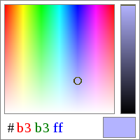
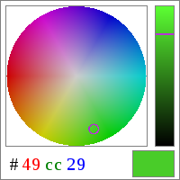

# HtmlPalette 

An HTML5 color picker designed to be intuitive and easy to use. Comes in square and radial versions.

[Live demo](https://stevenvergenz.github.io/html-palette/) [Minified](https://raw.githubusercontent.com/stevenvergenz/html-palette/master/build/html-palette.min.js) [Uncompressed](https://raw.githubusercontent.com/stevenvergenz/html-palette/master/build/html-palette.js)

 


## Examples

### Vanilla JS

```javascript
var trigger = document.getElementById('picker');
var palette = new HtmlPalette(trigger, {
	initialColor: '49cc29',
	colorCallback: function(color){
		trigger.style['background-color'] = '#'+color.hex;
	}
});
```

### jQuery

```javascript
$('#picker').HtmlPalette({
	initialColor: {h:0, s:0.8, v:0.8},
	colorCallback: function(color){
		this.triggerElem.style['background-color'] = '#'+color.hex;
	}
});
```

### Angular.js

```javascript
angular.module('myApp', ['html-palette'])
	.controller('MyController', function($scope){
		$scope.color = {r: 0.8, g: 0.3, b: 1.0};
	});
```

```html
<div ng-app='myApp'>
	<div ng-controller='MyController'>
		<html-palette rgb-color='color'></html-color>
	</div>
</div>
```

## Usage

Include the script on your page, and you're ready to go.

```html
<script type='text/javascript' src='html-palette.min.js'></script>
```

The constructor for HtmlPalette has three forms, depending on what library you want to use for your workflow. They all take two things though: a trigger element and an options object. When the trigger element's `click` event is fired, the color picker will appear next to it. The available options are detailed in the Options section below.

* **Vanilla Javascript**:

	Construct an instance, and interact with it directly.

	```javascript
	var palette = new HtmlPalette(trigger, options);
	palette.destroy();
	```

* **jQuery**:

	Initialize and interact using the jQuery extension.

	```javascript
	$(trigger).HtmlPalette(options);
	$(trigger).HtmlPalette('radial', true);
	$(trigger).HtmlPalette('destroy');
	```

* **Angular.js**:

	The picker takes the form of a directive, so you can add it straight into your HTML, no Javascript required. The scope variable referred to by one of the attributes `hsv-color`, `rgb-color`, or `hex-color` (use only one) is bi-directionally bound to the picker's selected color, in the format specified by the attribute. Additional attributes are mapped to options in the usual Angular fashion: hyphenated to camel-case.

	```html
	<html-palette hex-color='myColor' popup-edge='nw'></html-palette>
	```

## Color Representations

This library uses three different representations for colors:

* 24-bit hexidecimal string, e.g. `'ffcc00'`
* RGB(A) object, with channel values in interval [0,1], e.g. `{r:1, b:0.75, g:0, a:1}`
* HSV(A) object, with channel values in interval [0,1], e.g. `{h:0, s:0.75, v:0.8}`

Alpha value is initialized to 1.0 unless specified. Any of these representations can be passed into the `initialColor` option or `color` setter method, and the other representations will be computed and provided to the color callback.


## Options/Properties

All options are also available for read/write on the resulting HtmlPalette instance, with exceptions noted.

### popupEdge

*Type*: `String`

*Default*: `'se'`

Determines where the picker will appear relative to the trigger element. Can be one of the eight cardinal directions: `'n'`, `'nw'`, `'w'`, `'sw'`, `'s'`, `'se'`, `'e'`, or `'ne'`.

### radial

*Type*: `boolean`

*Default*: `false`

If `false`, the color picker is drawn as a rectangle, with hue varying on the x axis and saturation varying on the y axis. If `true`, it is drawn as a circle, with hue varying with the angle and saturation varying with the radius.

### updateTriggerBg

*Type*: `boolean`

*Default*: `false`

When enabled, the picker trigger element's `background-color` style will be changed to the current selection color, with a checker pattern to indicate transparency if applicable.

### colorCallback

*Type*: `function(color)`

*Default*: `null`

A function called when the selected color changes, either from picker events or a call to the `color` setter function.

### initialColor (constructor option only)

*Type*: `String`|`Object`

*Default*: `'aaaaaa'`

The initial color selection of the picker. The color callback will be called once on initalization with this color, if a callback is provided.

### useAlpha (constructor option, read-only)

*Type*: `boolean`

*Default*: `false`

If specified, the widget controls will include a slider for the alpha channel.

## Other Instance Properties

* `elem` - The color picker element
* `triggerElem` - The element whose `click` event brings up the picker.
* `selection` - The internal color selection. Do not modify this directly, use the `color` method instead.

## Instance Methods

### color([newcolor])

The getter/setter function for the picker's currently selected color. If called with no arguments, i.e. `color()`, the method returns an object with properties `r, g, b`, `h, s, v`, and `hex`, corresponding to the three color representations noted above. If called with one argument, i.e. `color(newcolor)`, the selection color is set to the specified color (in any of the three representations), and the color callback is called.


### redraw()

Redraws the palette canvas. Only necessary after changing the `radial` property in the vanilla version.

### destroy()

Remove the color picker from the DOM, and unregister the click listener on the trigger element.
